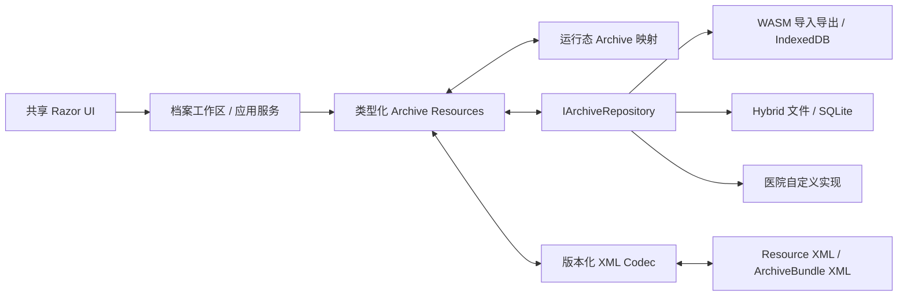

# ADR-0001：Resource/Bundle 与存储无关架构

- 状态：**已接受**
- 日期：2026-08-07
- 决策范围：EzNutrition 本地档案与交换格式

## 背景

EzNutrition 当前以 Blazor WebAssembly 运行，咨询对象及营养核算主要保存在浏览器内存中的运行态 `Archive`。未来计划同时提供 Blazor WebAssembly 和 Blazor Hybrid 宿主，并允许医院按自身条件实现文件、SQL 或其他存储。

现有运行态对象包含以下不适合长期持久化的内容：

- UI 是否可编辑、加载状态和当前页面状态；
- 事件处理器和服务引用；
- HTTP 获取的食物、营养素及 DRIs 元数据；
- 可重新生成的 `DataTable`、摘要行和计算过程；
- AI 流式发送中的临时状态；
- 构造函数依赖和接口类型。

直接序列化运行态对象会把当前实现细节固化为公共格式，使未来的 Hybrid、算法升级和医院存储难以演进。

## 决策

### 1. 使用类型化资源

每一种能够独立保存、引用或交换的临床或营养数据定义为一种资源，例如：

- `PatientResource`
- `ConsultationResource`
- `EnergyAssessmentResource`
- `DriAssessmentResource`
- `DietaryRecallResource`
- `QuestionnaireDefinitionResource`
- `QuestionnaireResponseResource`
- `SoapNoteResource`
- `NutritionPlanResource`
- `AiAdviceResource`

资源必须具有稳定标识、Schema 版本、记录时间和来源信息。需要关联患者或咨询时，使用稳定引用，不依赖数据库主键或 XML 节点位置。

### 2. 使用 Bundle 组合资源

`ArchiveBundle` 是交换容器，可以包含：

- 单个独立资源；
- 一次完整咨询；
- 某位患者的一段随访历史；
- 完整患者档案；
- 为迁移或审计准备的资源集合。

Bundle 只定义资源的集合、引用解析和交换元数据，不要求存储层将其作为一个巨大文件持续原地改写。

### 3. XML 只存在于边界层

共享档案核心负责：

- 识别格式和资源版本；
- 使用可信 Schema 验证；
- 读取版本化 XML DTO；
- 执行逐级迁移；
- 执行业务语义校验；
- 映射为当前类型化资源。

Razor UI 只接触类型化资源、应用服务和视图模型，不通过元素名称或 XPath 判断资源类型。

### 4. 存储实现可替换

应用层面向类型化档案仓储，不假设物理存储方式。允许的实现包括但不限于：

- WASM 文件导入与下载导出；
- 浏览器 IndexedDB；
- Hybrid 应用私有目录；
- SQLite；
- 医院自定义数据库或院内系统。

医院可以自行决定表结构、索引和事务，但必须满足公共仓储接口及兼容性测试。

### 5. 输入、来源和历史结果共同归档

只保存原始输入不足以复核历史结果，因为算法、食物成分表和 DRIs 数据会变化。对于具有计算意义的资源，档案应该同时保存：

- 原始输入；
- 专业人员手工修正；
- 当时展示或确认的结果快照；
- 计算引擎版本；
- 参考数据集身份与版本；
- 生成时间和必要的来源信息。

新版本可以提供“使用当前算法重新核算”，但不得静默覆盖历史结果。

## 组件关系

## 结果

### 正面影响

- WASM 与 Hybrid 可以共享资源模型、验证、迁移和大部分 UI；
- XML 格式不会被当前 Blazor 组件或数据库结构绑死；
- 单个资源和完整档案使用同一语义模型；
- 医院实现可以使用 SQL 查询，同时仍能导入导出标准 XML；
- 新旧算法结果可以并存并被明确区分；
- 未知资源能够以不丢失数据的方式保留或拒绝编辑。

### 成本与约束

- 需要维护版本化 DTO、Schema、迁移器和兼容性样本；
- 运行态 `Archive` 与档案资源之间必须存在显式映射；
- 资源引用、更新冲突和标识作用域需要在 V1 发布前确定；
- SQL 实现必须额外处理未知扩展的无损保存；
- 完整归档会比只保存当前输入占用更多空间。

## 被否决的替代方案

### 直接 XML 序列化当前 `Archive`

否决原因：运行态对象含有接口、事件、临时状态和服务依赖，格式会随 UI 及实现重构而破坏。

### Razor 组件直接解析 XML

否决原因：造成 XML、版本迁移和 UI 强耦合，WASM 与 Hybrid 难以共享稳定的应用逻辑。

### 把一个巨大患者 XML 作为唯一实时数据库

否决原因：局部更新、并发、损坏恢复、查询和长期增长都较困难。完整 Bundle 仍可作为交换和备份格式。

### 以当前 SQL 表结构作为规范

否决原因：医院实现、浏览器存储和未来本地客户端会被当前服务器数据库约束，且数据库 migration 会变成档案格式 migration。

### 在第一阶段完整采用 FHIR

暂不采用。未来应保留映射到医疗互操作标准的可能，但第一阶段不承担完整 FHIR 实现、术语系统和一致性要求。

## 后续决策

本 ADR 不冻结资源字段、命名空间、加密格式或更新模型。这些事项记录在[开放决策](../open-decisions.md)中，解决后才能发布 V1 Schema。
